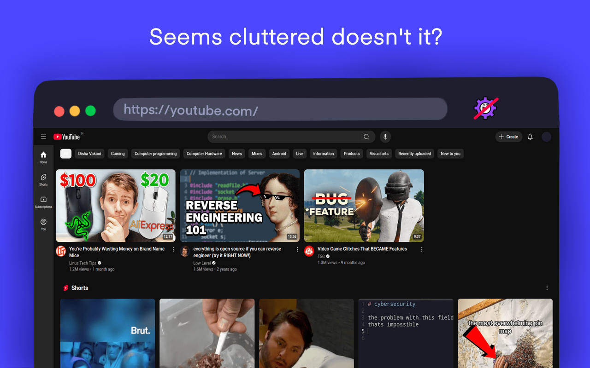
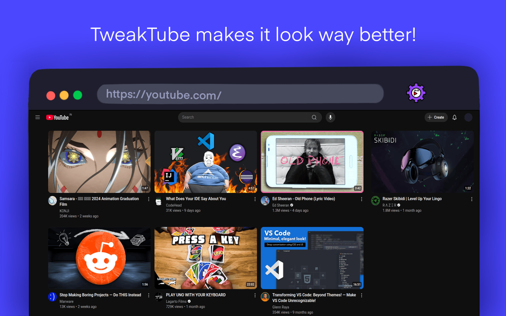
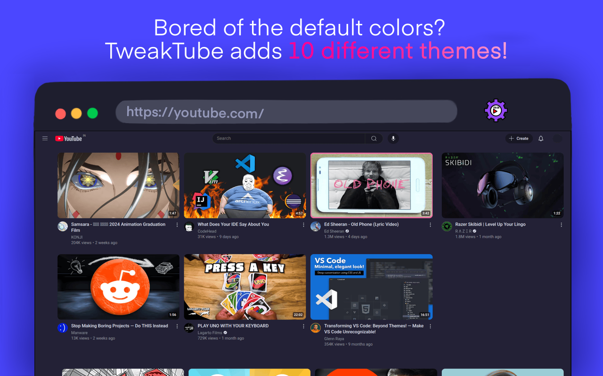
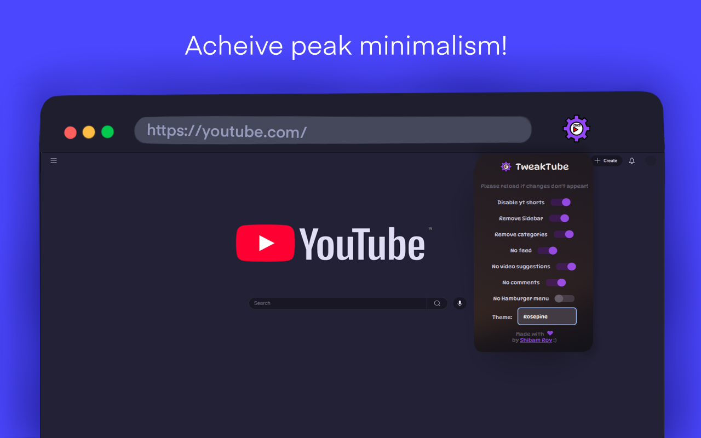

# TweakTube


A chrome extension that allows you to customize [YouTube](https://youtube.com) to your liking!

> [!NOTE]
> Please report any bugs as soon as you face them! You can either open an issue here, or contact me at royshibam9826@gmail.com

## Features 😎

You can toggle the following:
- Youtube shorts
- Video suggestions
- Home screen feed
- Comment section
- Hamburger menu icon
- Unextended sidebar

Along with that:
- It comes with 10 different themes!
- It is extremely simple to use!

## Demo 📷









## Theme list

This extension includes a lot of themes for youtube, here's the list:

- Catppuccin Mocha
- Catppuccin Macchiato
- Catppuccin Latte
- Catppuccin Frappe
- Rosepine
- Nord
- Gruvbox
- Solarized dark
- Solarized light
- Default youtube colors

## Privacy Policy 🔒

This extension doesn't send me any data whatsoever! I do not plan to collect data or sell them anywhere. It only stores the selected options locally in your own device.

## Installation 🛠️

Installation is really simple! All you need to do is download this repository.

1. You can either use the **Green colored "code" button** on top, and click on **"Download zip"**.
Next, you need to extract the zip file in your computer.

OR

You can also run this in your terminal/command prompt(requires git):

```bash
git clone https://github.com/ShibamRoy9826/tweaktube.git
```

2. Once you have the folder, 
    - Open Google Chrome
    - Go to [chrome://extensions](chrome://extensions)
    - Enable **"Developer Mode"** using the top right switch
    - Click on **"Load unpacked"**
    - Find the location where you've extracted/cloned this repository, and **double click on "manifest.json"**

3. Done! Now you've successfully installed TweakTube! Try it out and give me some feedback :) 

## Known Bugs 🐞

- ~A dark shadow appears in the categories bar which doesn't change even after changing theme~
- ~Extended sidebar and~ community posts still don't have any effect after changing the theme

## To-Do list ✏️

- [ ] Add a youtube video download button
- [ ] Add more themes
- [ ] Make a website for TweakTube
- [ ] Make a youtube video for TweakTube

## Contributing 🙏

Everyone is welcome to contribute to the code!
You can also raise an issue, or suggest any features that you think would be great :)

> ✨ Please star this repository if you liked this project 😁
